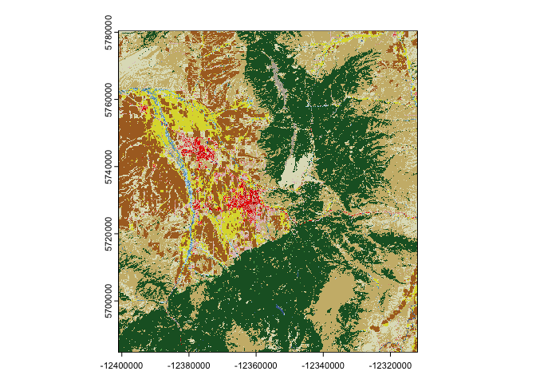

# Google Earth Engine guide: Part 1


#### Motivation

- Spatial data analyses require high quality spatial covariates.

- Textbook problems may include necessary covariates, but most
  “real-world” scenarios do not.

- No many spatial data warehouses are free and easily interface with R

#### Google Earth Engine

- Google Earth Engine - not to be confused with Google Earth, contains a
  huge amount of [spatial
  data](https://developers.google.com/earth-engine/datasets) - most of
  which is from satellite imagery.

- In addition to landuse datasets, Google Earth Engine also has data
  like:

  - [Night-time
    Lights](https://developers.google.com/earth-engine/datasets/catalog/BNU_FGS_CCNL_v1)
  - [Human
    Population](https://developers.google.com/earth-engine/datasets/catalog/CIESIN_GPWv411_GPW_Data_Context)
  - [Weather
    Data](https://developers.google.com/earth-engine/datasets/catalog/IDAHO_EPSCOR_GRIDMET)
  - and many more

### Setting up Google Earth Engine

#### 1. Register for GEE

- Visit <https://developers.google.com/earth-engine> and register your
  account. Note that google earth engine is free for [non-profit
  use](https://earthengine.google.com/noncommercial/).
- Click the unpaid usage box when connecting your gmail account.
- Create a new cloud project - I’ve named mine STAT 534.
- Lastly, accept terms of usage.

This will give the the opportunity to open the earth engine code editor.

#### 2. Earth Engine Code Editor

Earth engine has a built in Java-Script code editor. In addition to the
javascript code editor, earth engine also allows supports a python API.
Fortunately for R users, there is an R package that takes advantage of
this. For now the focus will be on using the code editor directly.

- explore the Scripts tab and run a few examples. Here is the
  `normalized difference` script. You can run these scripts and see the
  map change:

<!-- -->

    // NormalizedDifference example.
    //
    // Compute Normalized Difference Vegetation Index over MOD09GA product.
    // NDVI = (NIR - RED) / (NIR + RED), where
    // RED is sur_refl_b01, 620-670nm
    // NIR is sur_refl_b02, 841-876nm

    // Load a MODIS image.
    var img = ee.Image('MODIS/006/MOD09GA/2012_03_09');

    // Use the normalizedDifference(A, B) to compute (A - B) / (A + B)
    var ndvi = img.normalizedDifference(['sur_refl_b02', 'sur_refl_b01']);

    // Make a palette: a list of hex strings.
    var palette = ['FFFFFF', 'CE7E45', 'DF923D', 'F1B555', 'FCD163', '99B718',
                   '74A901', '66A000', '529400', '3E8601', '207401', '056201',
                   '004C00', '023B01', '012E01', '011D01', '011301'];

    // Center the map
    Map.setCenter(-94.84497, 39.01918, 8);

    // Display the input image and the NDVI derived from it.
    Map.addLayer(img.select(['sur_refl_b01', 'sur_refl_b04', 'sur_refl_b03']),
             {gain: [0.1, 0.1, 0.1]}, 'MODIS bands 1/4/3');
    Map.addLayer(ndvi, {min: 0, max: 1, palette: palette}, 'NDVI');

- The examples tab also allows you to view datasets. For example the
  USGS creates a national land cover data base that we can view.

<!-- -->

    // Import the NLCD collection.
    var dataset = ee.ImageCollection('USGS/NLCD_RELEASES/2021_REL/NLCD');

    // The collection contains images for the 2021 year release and the full suite
    // of products.
    print('Products:', dataset.aggregate_array('system:index'));

    // Filter the collection to the 2021 product.
    var nlcd2021 = dataset.filter(ee.Filter.eq('system:index', '2021')).first();

    // Each product has multiple bands for describing aspects of land cover.
    print('Bands:', nlcd2021.bandNames());

    // Select the land cover band.
    var landcover = nlcd2021.select('landcover');

    // Display land cover on the map.
    Map.setCenter(-95, 38, 5);
    Map.addLayer(landcover, null, 'Landcover');

- You can download images for use in R or just for viewing. Generally,
  we will want to do so on a reduced geographic scope. Here is an
  example…

<!-- -->

    // Import the NLCD collection.
    var dataset = ee.ImageCollection('USGS/NLCD_RELEASES/2021_REL/NLCD');

    // The collection contains images for the 2021 year release and the full suite
    // of products.
    print('Products:', dataset.aggregate_array('system:index'));

    // Filter the collection to the 2021 product.
    var nlcd2021 = dataset.filter(ee.Filter.eq('system:index', '2021')).first();

    // Each product has multiple bands for describing aspects of land cover.
    print('Bands:', nlcd2021.bandNames());

    // Select the land cover band.
    var landcover = nlcd2021.select('landcover');

    // Display land cover on the map.
    Map.setCenter(-95, 38, 5);
    Map.addLayer(landcover, null, 'Landcover');

    var boz_box = ee.Geometry.Rectangle([-110.6, 45.4, -111.4, 46]);

    Map.addLayer(boz_box, null, 'box');

    // Retrieve the projection information from a band of the original image.
    // Call getInfo() on the projection to request a client-side object containing
    // the crs and transform information needed for the client-side Export function.
    var projection = landcover.projection().getInfo();

    // Export the image, specifying the CRS, transform, and region.
    Export.image.toDrive({
      image: landcover,
      description: 'landcover_bozo',
      crs: projection.crs,
      crsTransform: projection.transform,
      region: boz_box
    });

Running the download task in the console will enable you to export
images. I’d suggest downloading the file to your Google drive account as
a geoTiff file.

When exporting images, you’ll likely need to set the coordinate
reference system (basically how the projection of spherical data is made
into two dimensions) for the download. For this particular image, I’d
recommend specify this `EPSG:3857`.

------------------------------------------------------------------------

### 3. Back to R

Now we will return to R and import our objects using the `terra`
package. I’ve saved my image as `landcover_bozeman.tif`.

``` r
library(terra)
```

    terra 1.7.78

``` r
describe("landcover_bozeman.tif")
```

      [1] "Driver: GTiff/GeoTIFF"                                                     
      [2] "Files: landcover_bozeman.tif"                                              
      [3] "Size is 2969, 3193"                                                        
      [4] "Coordinate System is:"                                                     
      [5] "PROJCRS[\"WGS 84 / Pseudo-Mercator\","                                     
      [6] "    BASEGEOGCRS[\"WGS 84\","                                               
      [7] "        ENSEMBLE[\"World Geodetic System 1984 ensemble\","                 
      [8] "            MEMBER[\"World Geodetic System 1984 (Transit)\"],"             
      [9] "            MEMBER[\"World Geodetic System 1984 (G730)\"],"                
     [10] "            MEMBER[\"World Geodetic System 1984 (G873)\"],"                
     [11] "            MEMBER[\"World Geodetic System 1984 (G1150)\"],"               
     [12] "            MEMBER[\"World Geodetic System 1984 (G1674)\"],"               
     [13] "            MEMBER[\"World Geodetic System 1984 (G1762)\"],"               
     [14] "            MEMBER[\"World Geodetic System 1984 (G2139)\"],"               
     [15] "            ELLIPSOID[\"WGS 84\",6378137,298.257223563,"                   
     [16] "                LENGTHUNIT[\"metre\",1]],"                                 
     [17] "            ENSEMBLEACCURACY[2.0]],"                                       
     [18] "        PRIMEM[\"Greenwich\",0,"                                           
     [19] "            ANGLEUNIT[\"degree\",0.0174532925199433]],"                    
     [20] "        ID[\"EPSG\",4326]],"                                               
     [21] "    CONVERSION[\"Popular Visualisation Pseudo-Mercator\","                 
     [22] "        METHOD[\"Popular Visualisation Pseudo Mercator\","                 
     [23] "            ID[\"EPSG\",1024]],"                                           
     [24] "        PARAMETER[\"Latitude of natural origin\",0,"                       
     [25] "            ANGLEUNIT[\"degree\",0.0174532925199433],"                     
     [26] "            ID[\"EPSG\",8801]],"                                           
     [27] "        PARAMETER[\"Longitude of natural origin\",0,"                      
     [28] "            ANGLEUNIT[\"degree\",0.0174532925199433],"                     
     [29] "            ID[\"EPSG\",8802]],"                                           
     [30] "        PARAMETER[\"False easting\",0,"                                    
     [31] "            LENGTHUNIT[\"metre\",1],"                                      
     [32] "            ID[\"EPSG\",8806]],"                                           
     [33] "        PARAMETER[\"False northing\",0,"                                   
     [34] "            LENGTHUNIT[\"metre\",1],"                                      
     [35] "            ID[\"EPSG\",8807]]],"                                          
     [36] "    CS[Cartesian,2],"                                                      
     [37] "        AXIS[\"easting (X)\",east,"                                        
     [38] "            ORDER[1],"                                                     
     [39] "            LENGTHUNIT[\"metre\",1]],"                                     
     [40] "        AXIS[\"northing (Y)\",north,"                                      
     [41] "            ORDER[2],"                                                     
     [42] "            LENGTHUNIT[\"metre\",1]],"                                     
     [43] "    USAGE["                                                                
     [44] "        SCOPE[\"Web mapping and visualisation.\"],"                        
     [45] "        AREA[\"World between 85.06°S and 85.06°N.\"],"                     
     [46] "        BBOX[-85.06,-180,85.06,180]],"                                     
     [47] "    ID[\"EPSG\",3857]]"                                                    
     [48] "Data axis to CRS axis mapping: 1,2"                                        
     [49] "Origin = (-12400995.000000000000000,5780475.000000000000000)"              
     [50] "Pixel Size = (30.000000000000000,-30.000000000000000)"                     
     [51] "Metadata:"                                                                 
     [52] "  AREA_OR_POINT=Area"                                                      
     [53] "Image Structure Metadata:"                                                 
     [54] "  COMPRESSION=LZW"                                                         
     [55] "  INTERLEAVE=BAND"                                                         
     [56] "Corner Coordinates:"                                                       
     [57] "Upper Left  (-12400995.000, 5780475.000) (111d24' 0.12\"W, 46d 0' 2.83\"N)"
     [58] "Lower Left  (-12400995.000, 5684685.000) (111d24' 0.12\"W, 45d23'59.33\"N)"
     [59] "Upper Right (-12311925.000, 5780475.000) (110d35'59.65\"W, 46d 0' 2.83\"N)"
     [60] "Lower Right (-12311925.000, 5684685.000) (110d35'59.65\"W, 45d23'59.33\"N)"
     [61] "Center      (-12356460.000, 5732580.000) (110d59'59.89\"W, 45d42' 3.98\"N)"
     [62] "Band 1 Block=256x256 Type=Byte, ColorInterp=Palette"                       
     [63] "  Description = landcover"                                                 
     [64] "  Color Table (RGB with 256 entries)"                                      
     [65] "    0: 0,0,0,255"                                                          
     [66] "    1: 0,0,0,255"                                                          
     [67] "    2: 0,0,0,255"                                                          
     [68] "    3: 0,0,0,255"                                                          
     [69] "    4: 0,0,0,255"                                                          
     [70] "    5: 0,0,0,255"                                                          
     [71] "    6: 0,0,0,255"                                                          
     [72] "    7: 0,0,0,255"                                                          
     [73] "    8: 0,0,0,255"                                                          
     [74] "    9: 0,0,0,255"                                                          
     [75] "   10: 0,0,0,255"                                                          
     [76] "   11: 70,107,159,255"                                                     
     [77] "   12: 209,222,248,255"                                                    
     [78] "   13: 0,0,0,255"                                                          
     [79] "   14: 0,0,0,255"                                                          
     [80] "   15: 0,0,0,255"                                                          
     [81] "   16: 0,0,0,255"                                                          
     [82] "   17: 0,0,0,255"                                                          
     [83] "   18: 0,0,0,255"                                                          
     [84] "   19: 0,0,0,255"                                                          
     [85] "   20: 0,0,0,255"                                                          
     [86] "   21: 222,197,197,255"                                                    
     [87] "   22: 217,146,130,255"                                                    
     [88] "   23: 235,0,0,255"                                                        
     [89] "   24: 171,0,0,255"                                                        
     [90] "   25: 0,0,0,255"                                                          
     [91] "   26: 0,0,0,255"                                                          
     [92] "   27: 0,0,0,255"                                                          
     [93] "   28: 0,0,0,255"                                                          
     [94] "   29: 0,0,0,255"                                                          
     [95] "   30: 0,0,0,255"                                                          
     [96] "   31: 179,172,159,255"                                                    
     [97] "   32: 0,0,0,255"                                                          
     [98] "   33: 0,0,0,255"                                                          
     [99] "   34: 0,0,0,255"                                                          
    [100] "   35: 0,0,0,255"                                                          
    [101] "   36: 0,0,0,255"                                                          
    [102] "   37: 0,0,0,255"                                                          
    [103] "   38: 0,0,0,255"                                                          
    [104] "   39: 0,0,0,255"                                                          
    [105] "   40: 0,0,0,255"                                                          
    [106] "   41: 104,171,95,255"                                                     
    [107] "   42: 28,95,44,255"                                                       
    [108] "   43: 181,197,143,255"                                                    
    [109] "   44: 0,0,0,255"                                                          
    [110] "   45: 0,0,0,255"                                                          
    [111] "   46: 0,0,0,255"                                                          
    [112] "   47: 0,0,0,255"                                                          
    [113] "   48: 0,0,0,255"                                                          
    [114] "   49: 0,0,0,255"                                                          
    [115] "   50: 0,0,0,255"                                                          
    [116] "   51: 0,0,0,255"                                                          
    [117] "   52: 204,184,121,255"                                                    
    [118] "   53: 0,0,0,255"                                                          
    [119] "   54: 0,0,0,255"                                                          
    [120] "   55: 0,0,0,255"                                                          
    [121] "   56: 0,0,0,255"                                                          
    [122] "   57: 0,0,0,255"                                                          
    [123] "   58: 0,0,0,255"                                                          
    [124] "   59: 0,0,0,255"                                                          
    [125] "   60: 0,0,0,255"                                                          
    [126] "   61: 0,0,0,255"                                                          
    [127] "   62: 0,0,0,255"                                                          
    [128] "   63: 0,0,0,255"                                                          
    [129] "   64: 0,0,0,255"                                                          
    [130] "   65: 0,0,0,255"                                                          
    [131] "   66: 0,0,0,255"                                                          
    [132] "   67: 0,0,0,255"                                                          
    [133] "   68: 0,0,0,255"                                                          
    [134] "   69: 0,0,0,255"                                                          
    [135] "   70: 0,0,0,255"                                                          
    [136] "   71: 223,223,194,255"                                                    
    [137] "   72: 0,0,0,255"                                                          
    [138] "   73: 0,0,0,255"                                                          
    [139] "   74: 0,0,0,255"                                                          
    [140] "   75: 0,0,0,255"                                                          
    [141] "   76: 0,0,0,255"                                                          
    [142] "   77: 0,0,0,255"                                                          
    [143] "   78: 0,0,0,255"                                                          
    [144] "   79: 0,0,0,255"                                                          
    [145] "   80: 0,0,0,255"                                                          
    [146] "   81: 220,217,57,255"                                                     
    [147] "   82: 171,108,40,255"                                                     
    [148] "   83: 0,0,0,255"                                                          
    [149] "   84: 0,0,0,255"                                                          
    [150] "   85: 0,0,0,255"                                                          
    [151] "   86: 0,0,0,255"                                                          
    [152] "   87: 0,0,0,255"                                                          
    [153] "   88: 0,0,0,255"                                                          
    [154] "   89: 0,0,0,255"                                                          
    [155] "   90: 184,217,235,255"                                                    
    [156] "   91: 0,0,0,255"                                                          
    [157] "   92: 0,0,0,255"                                                          
    [158] "   93: 0,0,0,255"                                                          
    [159] "   94: 0,0,0,255"                                                          
    [160] "   95: 108,159,184,255"                                                    
    [161] "   96: 0,0,0,255"                                                          
    [162] "   97: 0,0,0,255"                                                          
    [163] "   98: 0,0,0,255"                                                          
    [164] "   99: 0,0,0,255"                                                          
    [165] "  100: 0,0,0,255"                                                          
    [166] "  101: 0,0,0,255"                                                          
    [167] "  102: 0,0,0,255"                                                          
    [168] "  103: 0,0,0,255"                                                          
    [169] "  104: 0,0,0,255"                                                          
    [170] "  105: 0,0,0,255"                                                          
    [171] "  106: 0,0,0,255"                                                          
    [172] "  107: 0,0,0,255"                                                          
    [173] "  108: 0,0,0,255"                                                          
    [174] "  109: 0,0,0,255"                                                          
    [175] "  110: 0,0,0,255"                                                          
    [176] "  111: 0,0,0,255"                                                          
    [177] "  112: 0,0,0,255"                                                          
    [178] "  113: 0,0,0,255"                                                          
    [179] "  114: 0,0,0,255"                                                          
    [180] "  115: 0,0,0,255"                                                          
    [181] "  116: 0,0,0,255"                                                          
    [182] "  117: 0,0,0,255"                                                          
    [183] "  118: 0,0,0,255"                                                          
    [184] "  119: 0,0,0,255"                                                          
    [185] "  120: 0,0,0,255"                                                          
    [186] "  121: 0,0,0,255"                                                          
    [187] "  122: 0,0,0,255"                                                          
    [188] "  123: 0,0,0,255"                                                          
    [189] "  124: 0,0,0,255"                                                          
    [190] "  125: 0,0,0,255"                                                          
    [191] "  126: 0,0,0,255"                                                          
    [192] "  127: 0,0,0,255"                                                          
    [193] "  128: 0,0,0,255"                                                          
    [194] "  129: 0,0,0,255"                                                          
    [195] "  130: 0,0,0,255"                                                          
    [196] "  131: 0,0,0,255"                                                          
    [197] "  132: 0,0,0,255"                                                          
    [198] "  133: 0,0,0,255"                                                          
    [199] "  134: 0,0,0,255"                                                          
    [200] "  135: 0,0,0,255"                                                          
    [201] "  136: 0,0,0,255"                                                          
    [202] "  137: 0,0,0,255"                                                          
    [203] "  138: 0,0,0,255"                                                          
    [204] "  139: 0,0,0,255"                                                          
    [205] "  140: 0,0,0,255"                                                          
    [206] "  141: 0,0,0,255"                                                          
    [207] "  142: 0,0,0,255"                                                          
    [208] "  143: 0,0,0,255"                                                          
    [209] "  144: 0,0,0,255"                                                          
    [210] "  145: 0,0,0,255"                                                          
    [211] "  146: 0,0,0,255"                                                          
    [212] "  147: 0,0,0,255"                                                          
    [213] "  148: 0,0,0,255"                                                          
    [214] "  149: 0,0,0,255"                                                          
    [215] "  150: 0,0,0,255"                                                          
    [216] "  151: 0,0,0,255"                                                          
    [217] "  152: 0,0,0,255"                                                          
    [218] "  153: 0,0,0,255"                                                          
    [219] "  154: 0,0,0,255"                                                          
    [220] "  155: 0,0,0,255"                                                          
    [221] "  156: 0,0,0,255"                                                          
    [222] "  157: 0,0,0,255"                                                          
    [223] "  158: 0,0,0,255"                                                          
    [224] "  159: 0,0,0,255"                                                          
    [225] "  160: 0,0,0,255"                                                          
    [226] "  161: 0,0,0,255"                                                          
    [227] "  162: 0,0,0,255"                                                          
    [228] "  163: 0,0,0,255"                                                          
    [229] "  164: 0,0,0,255"                                                          
    [230] "  165: 0,0,0,255"                                                          
    [231] "  166: 0,0,0,255"                                                          
    [232] "  167: 0,0,0,255"                                                          
    [233] "  168: 0,0,0,255"                                                          
    [234] "  169: 0,0,0,255"                                                          
    [235] "  170: 0,0,0,255"                                                          
    [236] "  171: 0,0,0,255"                                                          
    [237] "  172: 0,0,0,255"                                                          
    [238] "  173: 0,0,0,255"                                                          
    [239] "  174: 0,0,0,255"                                                          
    [240] "  175: 0,0,0,255"                                                          
    [241] "  176: 0,0,0,255"                                                          
    [242] "  177: 0,0,0,255"                                                          
    [243] "  178: 0,0,0,255"                                                          
    [244] "  179: 0,0,0,255"                                                          
    [245] "  180: 0,0,0,255"                                                          
    [246] "  181: 0,0,0,255"                                                          
    [247] "  182: 0,0,0,255"                                                          
    [248] "  183: 0,0,0,255"                                                          
    [249] "  184: 0,0,0,255"                                                          
    [250] "  185: 0,0,0,255"                                                          
    [251] "  186: 0,0,0,255"                                                          
    [252] "  187: 0,0,0,255"                                                          
    [253] "  188: 0,0,0,255"                                                          
    [254] "  189: 0,0,0,255"                                                          
    [255] "  190: 0,0,0,255"                                                          
    [256] "  191: 0,0,0,255"                                                          
    [257] "  192: 0,0,0,255"                                                          
    [258] "  193: 0,0,0,255"                                                          
    [259] "  194: 0,0,0,255"                                                          
    [260] "  195: 0,0,0,255"                                                          
    [261] "  196: 0,0,0,255"                                                          
    [262] "  197: 0,0,0,255"                                                          
    [263] "  198: 0,0,0,255"                                                          
    [264] "  199: 0,0,0,255"                                                          
    [265] "  200: 0,0,0,255"                                                          
    [266] "  201: 0,0,0,255"                                                          
    [267] "  202: 0,0,0,255"                                                          
    [268] "  203: 0,0,0,255"                                                          
    [269] "  204: 0,0,0,255"                                                          
    [270] "  205: 0,0,0,255"                                                          
    [271] "  206: 0,0,0,255"                                                          
    [272] "  207: 0,0,0,255"                                                          
    [273] "  208: 0,0,0,255"                                                          
    [274] "  209: 0,0,0,255"                                                          
    [275] "  210: 0,0,0,255"                                                          
    [276] "  211: 0,0,0,255"                                                          
    [277] "  212: 0,0,0,255"                                                          
    [278] "  213: 0,0,0,255"                                                          
    [279] "  214: 0,0,0,255"                                                          
    [280] "  215: 0,0,0,255"                                                          
    [281] "  216: 0,0,0,255"                                                          
    [282] "  217: 0,0,0,255"                                                          
    [283] "  218: 0,0,0,255"                                                          
    [284] "  219: 0,0,0,255"                                                          
    [285] "  220: 0,0,0,255"                                                          
    [286] "  221: 0,0,0,255"                                                          
    [287] "  222: 0,0,0,255"                                                          
    [288] "  223: 0,0,0,255"                                                          
    [289] "  224: 0,0,0,255"                                                          
    [290] "  225: 0,0,0,255"                                                          
    [291] "  226: 0,0,0,255"                                                          
    [292] "  227: 0,0,0,255"                                                          
    [293] "  228: 0,0,0,255"                                                          
    [294] "  229: 0,0,0,255"                                                          
    [295] "  230: 0,0,0,255"                                                          
    [296] "  231: 0,0,0,255"                                                          
    [297] "  232: 0,0,0,255"                                                          
    [298] "  233: 0,0,0,255"                                                          
    [299] "  234: 0,0,0,255"                                                          
    [300] "  235: 0,0,0,255"                                                          
    [301] "  236: 0,0,0,255"                                                          
    [302] "  237: 0,0,0,255"                                                          
    [303] "  238: 0,0,0,255"                                                          
    [304] "  239: 0,0,0,255"                                                          
    [305] "  240: 0,0,0,255"                                                          
    [306] "  241: 0,0,0,255"                                                          
    [307] "  242: 0,0,0,255"                                                          
    [308] "  243: 0,0,0,255"                                                          
    [309] "  244: 0,0,0,255"                                                          
    [310] "  245: 0,0,0,255"                                                          
    [311] "  246: 0,0,0,255"                                                          
    [312] "  247: 0,0,0,255"                                                          
    [313] "  248: 0,0,0,255"                                                          
    [314] "  249: 0,0,0,255"                                                          
    [315] "  250: 0,0,0,255"                                                          
    [316] "  251: 0,0,0,255"                                                          
    [317] "  252: 0,0,0,255"                                                          
    [318] "  253: 0,0,0,255"                                                          
    [319] "  254: 0,0,0,255"                                                          
    [320] "  255: 0,0,0,255"                                                          

``` r
raster_in <- rast("landcover_bozeman.tif")
raster_in
```

    class       : SpatRaster 
    dimensions  : 3193, 2969, 1  (nrow, ncol, nlyr)
    resolution  : 30, 30  (x, y)
    extent      : -12400995, -12311925, 5684685, 5780475  (xmin, xmax, ymin, ymax)
    coord. ref. : WGS 84 / Pseudo-Mercator (EPSG:3857) 
    source      : landcover_bozeman.tif 
    color table : 1 
    name        : landcover 

``` r
plot(raster_in)
```



``` r
summary(as.factor(values(raster_in)))
```

          0      11      12      21      22      23      24      31      41      42 
      12754   16946       2  195522  121236   71459   12764   28528   22788 3163212 
         43      52      71      81      82      90      95 
      11304 2775415 1156512  548495 1213149   60664   69267 

[What are we seeing? These colors correspond to different land
classes.](https://www.mrlc.gov/data/legends/national-land-cover-database-class-legend-and-description).

The coded values of each landclass / pixel combination can be pulled
from the raster object directly.

``` r
library(tidyverse)
```

    ── Attaching core tidyverse packages ──────────────────────── tidyverse 2.0.0 ──
    ✔ dplyr     1.1.4     ✔ readr     2.1.5
    ✔ forcats   1.0.0     ✔ stringr   1.5.1
    ✔ ggplot2   3.5.1     ✔ tibble    3.2.1
    ✔ lubridate 1.9.3     ✔ tidyr     1.3.1
    ✔ purrr     1.0.2     
    ── Conflicts ────────────────────────────────────────── tidyverse_conflicts() ──
    ✖ tidyr::extract() masks terra::extract()
    ✖ dplyr::filter()  masks stats::filter()
    ✖ dplyr::lag()     masks stats::lag()
    ℹ Use the conflicted package (<http://conflicted.r-lib.org/>) to force all conflicts to become errors

``` r
landuse_df <- as.data.frame(raster_in, xy = TRUE)
```

------------------------------------------------------------------------

**Activity:** Extract and plot elevation (in R) for the coastal area
near Byron Bay, NSW, Australia.

------------------------------------------------------------------------

Next we will start to think about how this information can inform our
point process modeling.
